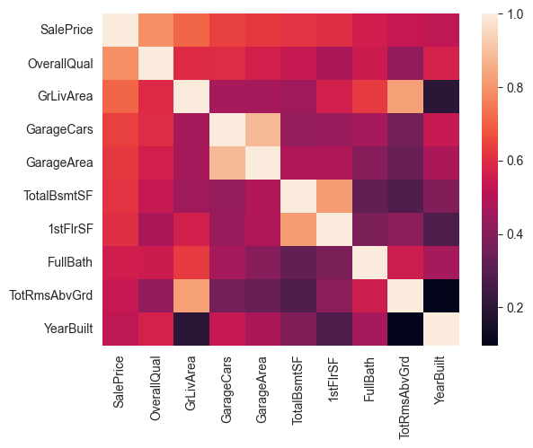
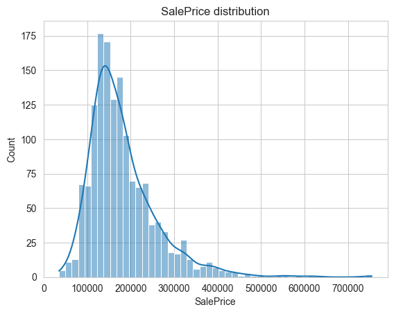
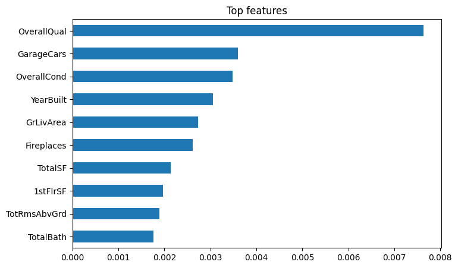
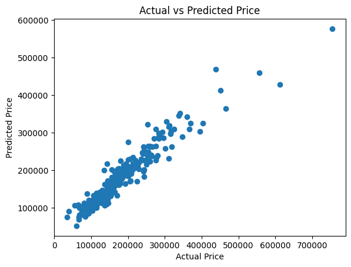

# House Price Prediction

This project builds a machine learning pipeline to predict house prices using the Ames Housing dataset.

## Project Overview

The goal of this project is to build an end-to-end machine learning workflow including data analysis, feature engineering, model training, hyperparameter tuning, and evaluation.

The final model predicts house sale prices based on multiple housing features such as size, location, and quality.

## Dataset

The dataset used is the Ames Housing Dataset which contains 79 explanatory variables describing residential homes.

Files:

* `train.csv` – training dataset with target variable `SalePrice`
* `test.csv` – test dataset for predictions

## Project Workflow

### 1. Data Understanding & EDA

* Data inspection
* Handling missing values
* Feature distribution analysis
* Correlation analysis



### 2. Feature Engineering

* Log transformation of target variable
* Handling categorical variables
* Encoding features
* Removing low-information columns


### 3. Model Training

Models trained:

* Linear Regression   rmse 0.2
* Ridge Regression    rmse 0.142
* Lasso Regression    rmse 0.145


### 4. Hyperparameter Tuning

Hyperparameters were optimized using GridSearchCV.

### 5. Model Evaluation

Metrics used:

* RMSE-0.0115, ridge_alpha = 429.19
* R² Score - 0.88

The final Ridge model achieved strong performance on validation data.

### 6. Pipeline Creation

A Scikit-learn pipeline was used to combine:

* StandardScaler
* Ridge Regression

This ensures consistent preprocessing during training and prediction.

### 7. Test Prediction

The trained model was used to generate predictions for the test dataset and produce a submission file.

## Project Structure

```
house_price_prediction
│
├── data
│   ├── train.csv
│   └── test.csv
│
├── notebooks
│   ├── 01_02_data_understanding_EDA.ipynb
│   ├── 03_model_training.ipynb
│   ├── 04_feature_engineering.ipynb
│   ├── 05_hyperparameter_tuning.ipynb
│   ├── 06_model_evaluation_pipeline.ipynb
│   └── 07_test_prediction.ipynb
│
├── models
│   └── final_house_price_model.pkl
│
├── images
│
├── .gitignore
└── README.md
```

## Technologies Used

* Python
* Pandas
* NumPy
* Scikit-learn
* Matplotlib
* Jupyter Notebook

## Future Improvements

* Feature selection
* Advanced models (XGBoost, Random Forest)
* Cross-validation improvements
* Deployment as a web app

## Author

Piyush Kumar
